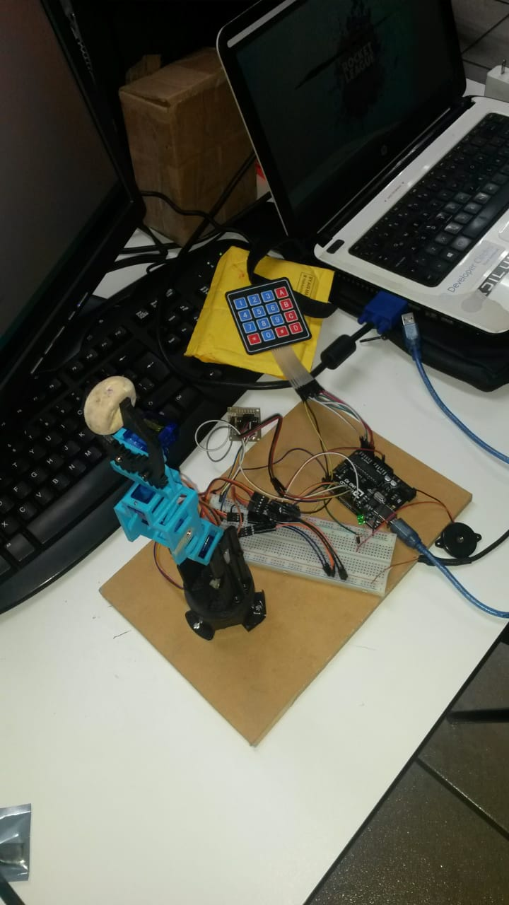

Brazo Robótico de 5 Ejes
========================

Autores
-------
* Ornelas Pérez Luis Saul
* Paniagua Soto Rafael
* Vallejo Herrera Juda Alector

Descripción de la Práctica
--------------------------

El propósito de esta práctica es desarrollar paso a paso un proyecto para controlar y programar
un Brazo Robot, simulando las funciones básicas de un robot industrial.

### Funciones básicas:

1. Programar: Registrar las posiciones de los brazos en tres dimensiones (cada registro es un "paso",
un programa consiste en una serie de pasos).

2. Ejecutar: Realiza en secuencia las posiciones registradas en el "Programa". El robot ejecutará
el programa hasta que se use el comando "ABORTAR".

### Características principales:

* El proyecto se usa para controlar robots con  5 DOF ("Grados de libertad").
* El robot se controla en modo "REMOTO" (a través de una programa en java por medio del puerto serial).
* La información para el usuario se proporciona a través de LEDS de colores.
* Contiene un botón de paro de emergencia (Físico).
* Si existe un fallo y/o corte de energía, después de restablecerse la corriente el robot
continúa el programa (aunque este no se encuentre conectado a la aplicación).
    
* Los brazos robóticos se pueden clasificar de acuerdo con el número de "articulaciones"
o "Grados de libertad" (DOF) que tienen.
* La "Base", o "Cintura", puede girar el brazo 360 grados, se utiliza un motor a pasos.
* El "Hombro" es el responsable de "levantar o bajar" el brazo verticalmente
* El "codo" hace que el brazo "avance o retroceda".
* La Muñeca hace que "gire" la Pinza.
* La "Garra" o "Pinza" funciona abriendo o cerrándose para "agarrar cosas".

Material
--------
### Hardware

* 1 Arduino UNO
* 1 Protoboard
* 1 Chasis de Brazo Robótico con 5 Grados de Libertad
* 4 Servomotores
* 1 Motor a Pasos
* 1 Módulo Controlador del Motor a Pasos (Puente H)
* 2 Leds de Colores
* 3 Resistencias de 330 Ohms
* 1 Teclado Matricial
* 1 Push Button
* Cables conectores

### Software
* IDE Arduino
* IDE Netbeans
* Lenguaje de programación Java

Especificaciones técnicas del equipo
------------------------------------
* Sistema Operativo: Ubuntu 16.04
* Procesador: AMD Radeon R2
* Memoria RAM: 8 GB

Diagrama de componentes
-----------------------

Descripción de funcionalidad
----------------------------

1. Mediante la interfaz de software se puede seleccionar el modo automático o modo manual.

2. Para que el modo automático el brazo robótico siga repitiendo la secuencia de pasos después de ser desconectado, es necesario guardar la información en la memoria EEPROM del Arduino.

3. La tabla de estados que se encuentra en la interfaz nos sirve para mandar las posiciones que se moverán los servos y el motor a pasos a Arduino y enseguida se guarden en la memoria EEPROM para que la secuencia de estados se siga repitiendo indefinidamente, hasta que se le añadan nuevos estados.

4. Se pueden añadir estados a la tabla, primero se tiene que llenar los cuadros de texto con los grados que se desea mover el brazo y después pulsando el botón de añadir, para quitar los estados, se pulsa el botón de quitar estados.

5. Para que el modo automático entre en operación, es necesario tener la opción de “Automático”, activada y esta se encuentra en la parte superior izquierda, activada.

6. El modo manual se controla con un teclado matricial, el cual añade o resta grados de movimiento al motor a pasos y a los servos.

7. Para que el modo automático entre en operación, es necesario tener la opción de “Manual”, activada y esta se encuentra en la parte superior derecha.

8. Si el botón físico de paro es presionado, el brazo detendrá la secuencia de estados que esta ejecutando y continuará hasta que se active en el teclado matricial, la opción de reanudar.

Resultados de la Práctica
-------------------------

### Interfaz de software hecha en JAVA

### Armado del circuito y Montaje del Robot

